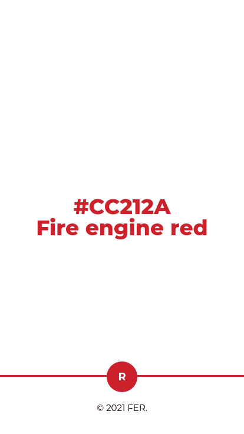
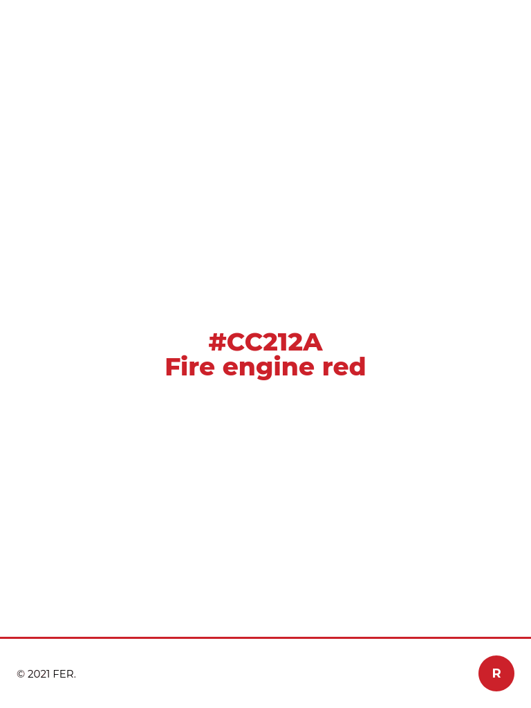

## Introducción

Este es el primer proyecto de maquetación completa individual realizado en el bootcamp de Adalab en agosto de 2023, aquí practiqué las bases de lo que llevaba aprendido a lo largo de la primera semana. 

> **NOTA:** En julio de 2024 actualizo las dependencias y automatizaciones de Gulp, las de origen del Starter Kit de Adalab dan conflicto y no se ejecuta el programa.

## Reto

Realizar una pequeña landing de presentación del **Fire Engine Red**. 

- Maquetación responsive.
- Un cuerpo que ocupe el alto de la pantalla.
- En su centro muestre el código hexadecimal (#CC212A) y el nombre "Fire Engine Red".
- Usar dicho color para la fuente y contrastar con el blanco digital más puro.
- Pie fijo a la ventana del navegador mostrando la marca de dicho color.

## Pantallas:

